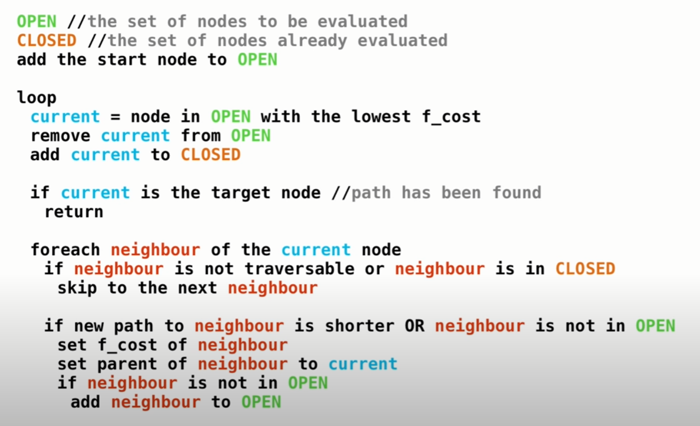
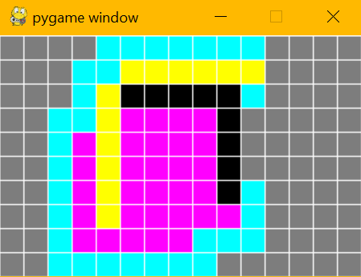

# Path Planning, A*
A star is a path search algorithm. It selects a path that minimizes 
```bash
f(n) = g(n) + h(n)
```
where n is the node, g is the cost of the path from the start node to n and g is the cost of the path from the node to the end.\
For eample, if g and h is using distance as cost, g is the distance from the starting node and h is the distance from the ending node. When it is a straight line from the start to the end, the total cost f will be constant. For every step away from the starting node is an equal step closer to the ending node.\
A* starts from the starting node, then looks at all the neighbor nodes for the least cost (shortest distance). The node becomes closed when if there are no paths eligible to be extended. It will always return a least cost path from start to end.

## Pseudocode


## Commands
Mouse click to change nodes in the grid\
Button mapping:\
1: default (gray)\
2: wall (black)\
3: starting node (green)\
4: ending node (red)\
c: start A* algorithm\
f: print f cost\
g: print g cost\
h: print h cost

## Pictures
cyan nodes are in open list\
magenta nodes are in closed list\
yellow nodes is the final path\

